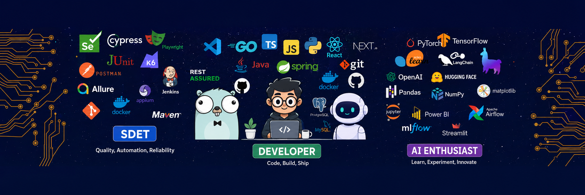

  

# Hi there, I'm Sohail 👋

Welcome to my GitHub profile! I'm a passionate developer committed to building scalable applications and solving complex problems through code. Explore my repositories to see what I've been working on.

---

## 🚀 About Me

- 💻 Full-stack developer with expertise in modern web technologies
- 🎯 Focused on building clean, maintainable, and efficient code
- 📚 Continuous learner passionate about new technologies
- 🤝 Open to collaboration and sharing knowledge with the community

---

## 💼 Tech Stack

### Languages & Frameworks

### Databases

### Tools & Platforms

---

## 📊 GitHub Statistics

  
  

---

## 🔥 GitHub Streak

  

---

## 📈 Activity Graph

  

---

## 🏆 Achievements & Highlights

- 🌟 Active open-source contributor
- 💡 Problem solver with a passion for clean architecture
- 🚀 Deployed multiple production-ready applications
- 📖 Committed to writing well-documented code

---

## 📫 Let's Connect

  

---

## 💬 Latest Thoughts

> "Code is not just about functionality; it's about creating solutions that make a difference."

---

  

---

**Last updated: May 2026**